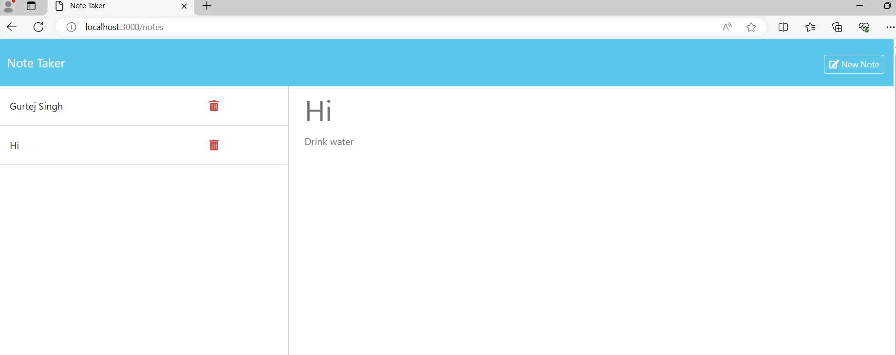

# 11 Express.js: Note Taker

It is an application called Note Taker that can be used to write and save notes. This application will use an Express.js back end and will save and retrieve note data from a JSON file. Backend of the application is built with Node.js and Express. Notes are stored in JSON file on the server. The UUID(unique id) generation is handled by the uuid helper.

## To run application install package using following cmd:
npm install

## To start server
npm run start

The following HTML routes are created:

* `GET /notes` returns the `notes.html` file.

* `GET *` returns the `index.html` file.

The following are API routes :

* `GET /api/notes` reads the `db.json` file and returns all saved notes as JSON.

* `POST /api/notes` receive a new note to save on the request body, add it to the `db.json` file, and then return the new note to the client. 

## Mock-Up

The following GIF shows the web application's appearance and functionality:

## Getting Started

On the back end, a `db.json` file is created  that will be used to store and retrieve notes using the `fs` module.

You are required to submit BOTH of the following for review:

* The URL of the functional, deployed application.

* The URL of the GitHub repository, with a unique name and a README describing the project.

